# Empress of Japan — VMM Capstone

An interactive, in-browser experience for the Vancouver Maritime Museum (VMM):
visitors step aboard a 360° recreation of the *Empress of Japan* ocean liners and
converse with historical personas (a captain, a first-class passenger, a crew
member) grounded in VMM archival material.

- **Live app:** https://d2kekuy8p1ofvv.cloudfront.net *(hosted on an AWS sandbox, decommissioned end of Aug 2026 — see [Demo](#demo) for the archived walkthrough)*
- **Course:** Northeastern CS 7980 Capstone, Summer 2026
- **Primary stakeholder:** Ashley Smith, VMM curator
- **Final showcase:** 2026-08-10

See [`CONTRIBUTING.md`](CONTRIBUTING.md) for team workflow and
[`CLAUDE.md`](CLAUDE.md) for repo conventions.

---

## Demo

> **Note:** the live app ran on an AWS Innovation Sandbox that is decommissioned at
> the end of August 2026, so the CloudFront link above will stop resolving. The
> recorded walkthrough and screenshots below are the archived record of the working
> system.

### Walkthrough video

[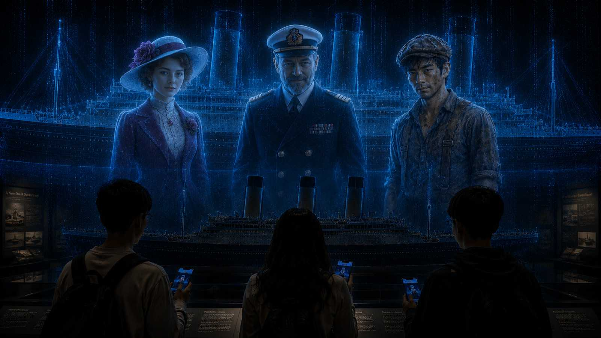](https://youtu.be/VIDEO_ID)

*~5-minute walkthrough: 360° ship exploration, persona voice Q&A, and the AWS
infrastructure + observability behind it.*

### The visitor experience

|  |  |
|---|---|
| 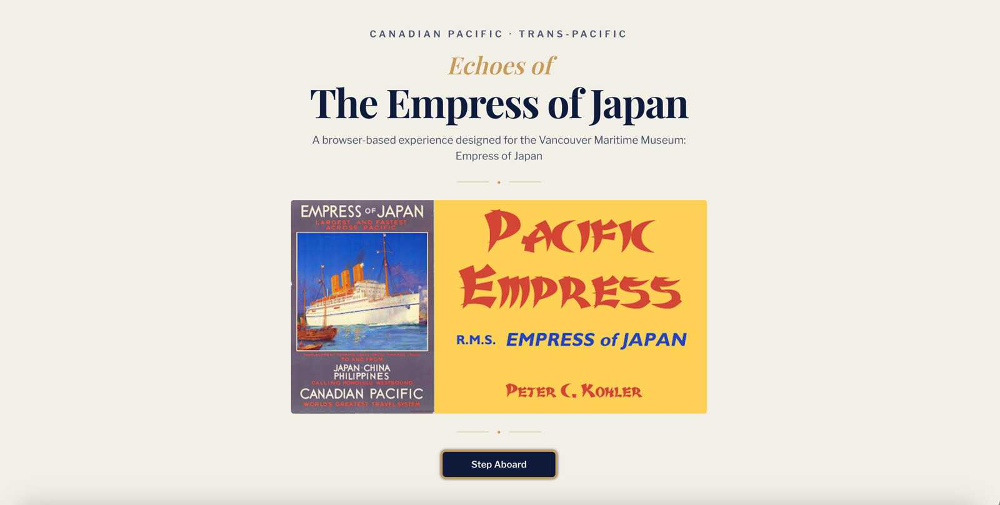 | 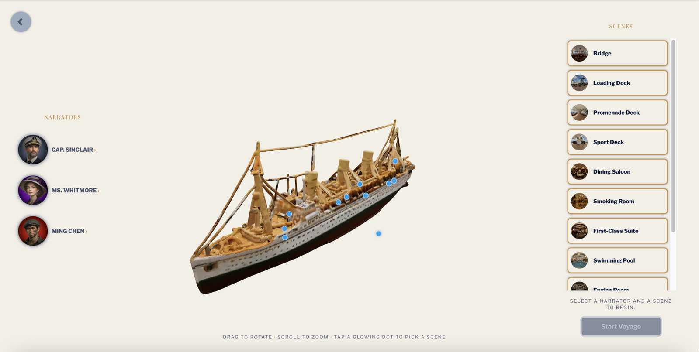 |
| Step aboard — landing | Interactive 3D ship hub: rotate, zoom, tap a hotspot to enter a scene |
| 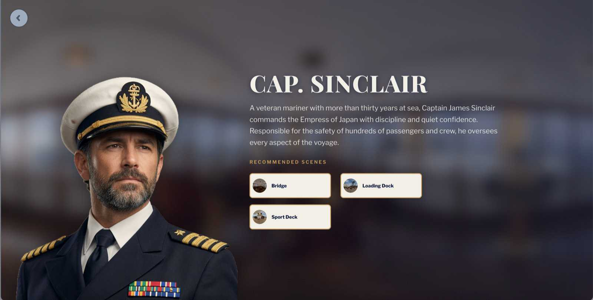 | 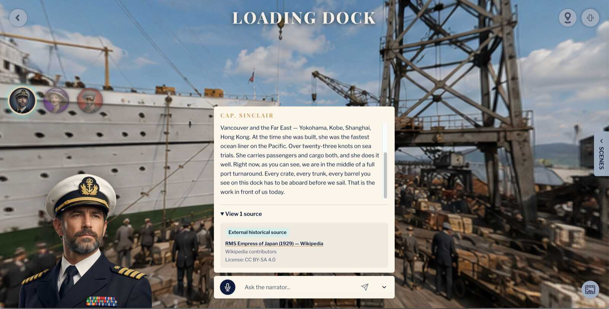 |
| Meet a historical persona narrator | Ask by voice or text — answers grounded in VMM archives, with cited sources |
| 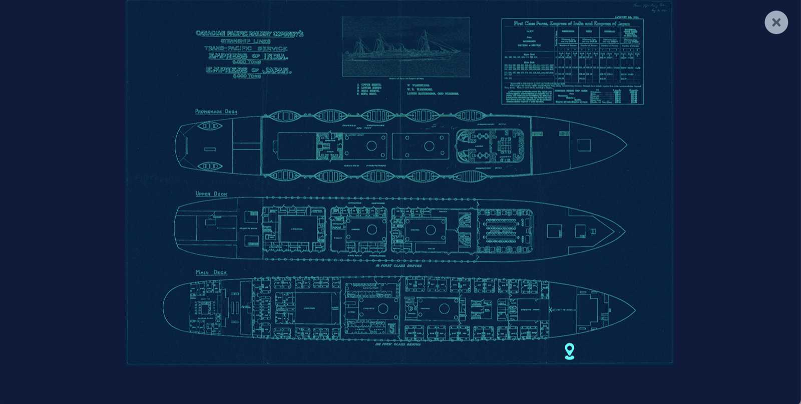 | 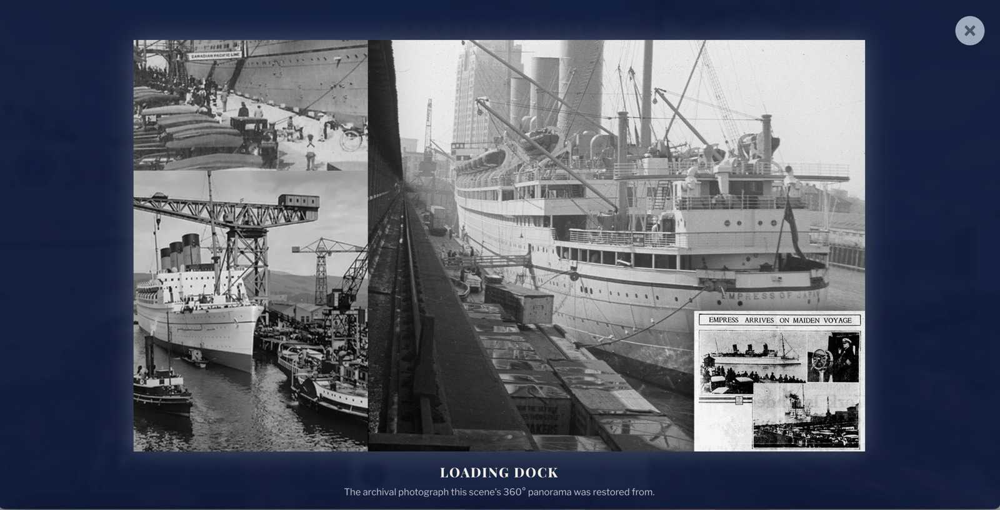 |
| In-scene ship map & scene navigation | Compare the 3D scene to the original archival photo |

**Meet the narrators**

|  |  |  |
|---|---|---|
|  | 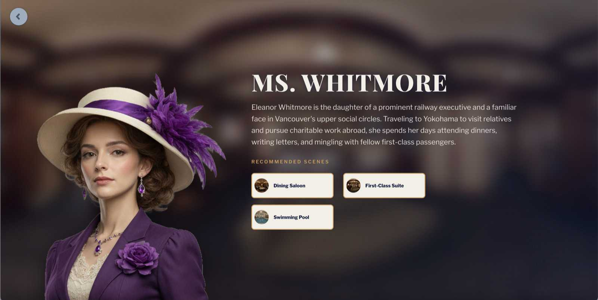 | 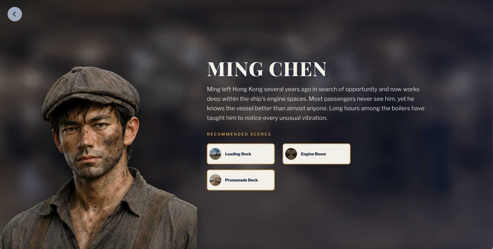 |
| Capt. Sinclair | Ms. Whitmore | Ming Chen |

### UX & mobile

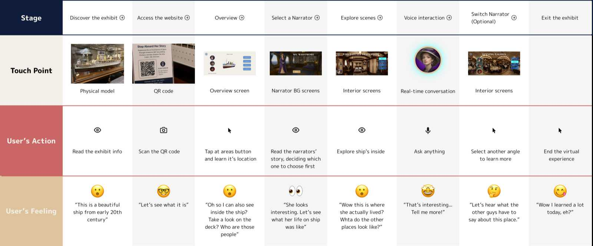

*Service journey mapped from museum entry through voice interaction to exit.*

|  |
|---|
| 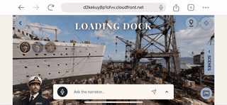 |
| Mobile-first: gyroscope-driven look-around (tilt the phone to look around the scene) |

### Architecture & infrastructure

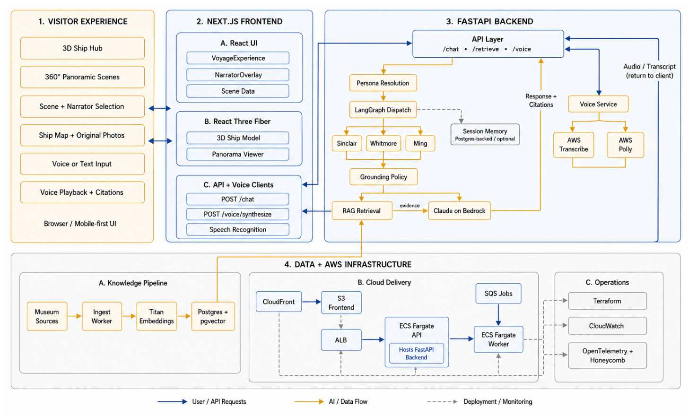

The entire stack — CloudFront, ALB, ECS Fargate, RDS, SQS, Bedrock — ran inside a
single **~$1,000 AWS sandbox**, provisioned with Terraform and observed end-to-end
with OpenTelemetry → Honeycomb and CloudWatch:

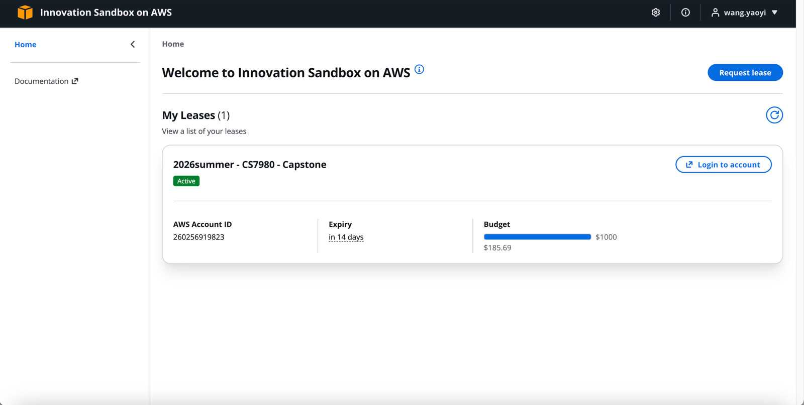

|  |  |
|---|---|
| 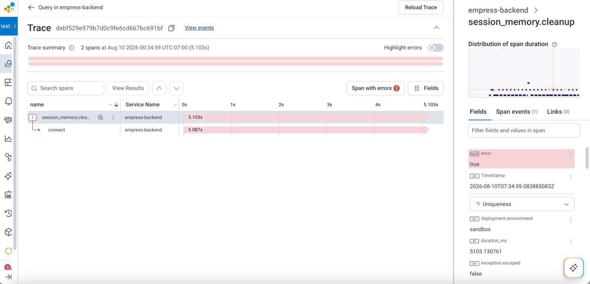 | 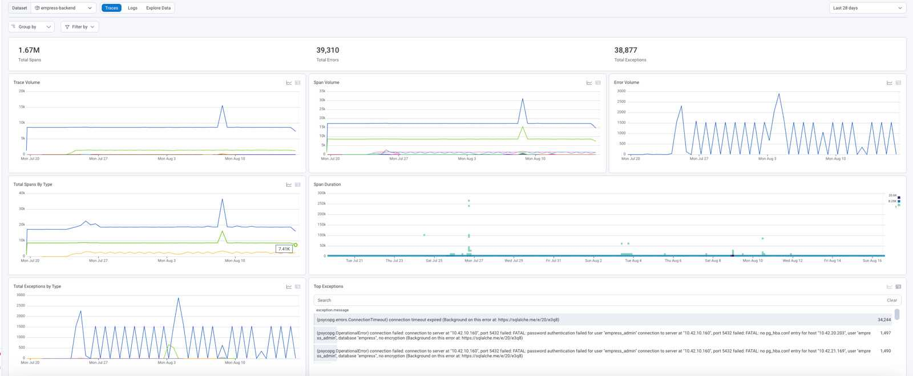 |
| Distributed trace of a request (OpenTelemetry → Honeycomb) — here catching a real error span | Honeycomb service dashboard |
| 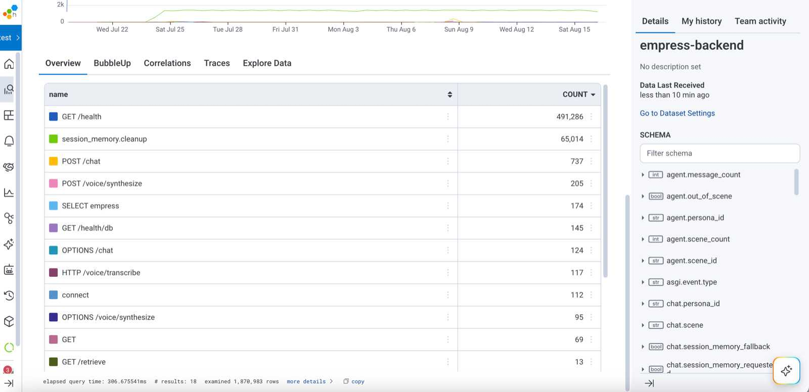 | 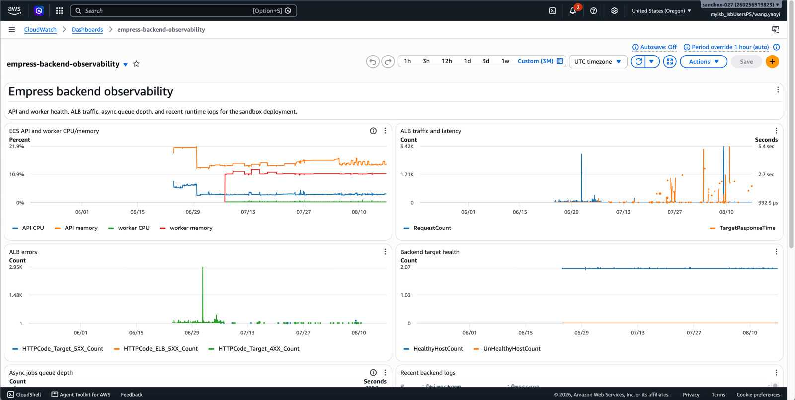 |
| Per-endpoint latency in Honeycomb | CloudWatch dashboard & alarms |
| 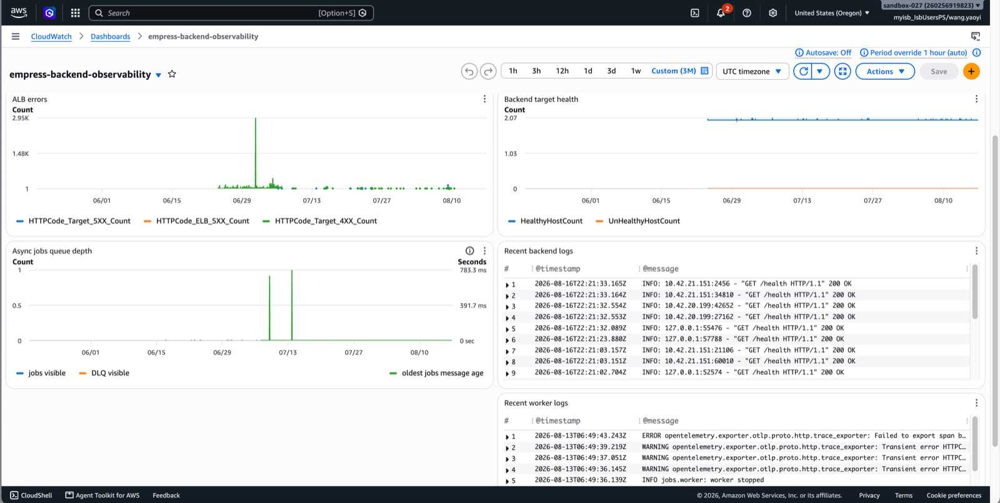 | 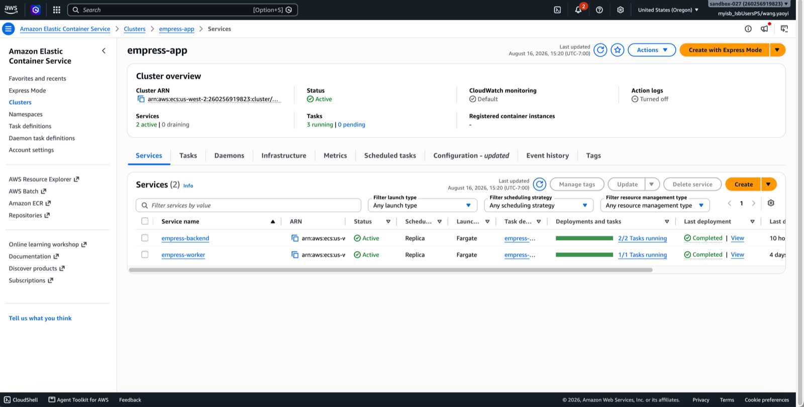 |
| CloudWatch metrics | ECS Fargate services |

---

## Architecture at a glance

```
Visitor (browser)
  ├─ Next.js 16 App Router + React 19
  ├─ React Three Fiber: 360° panorama viewer (drag + gyroscope) + GLB ship model
  ├─ Voice in: AWS Transcribe (primary STT) w/ Web Speech API fallback
  ├─ Voice out: AWS Polly (S3) w/ browser speechSynthesis fallback
  └─ Chat: fetch POST /chat  ──────────────┐
                                            ▼
                              CloudFront ─▶ ALB ─▶ ECS Fargate (FastAPI)
                                            │
                    ┌───────────────────────┼───────────────────────────┐
                    ▼                        ▼                           ▼
              LangGraph               Postgres 16 + pgvector        AWS Bedrock
        dispatch ─▶ persona ─▶ END    (RAG store, Titan embeds)   (Claude Sonnet 4-6,
        (persona picked at API)       via /retrieve endpoint       Titan embeddings)
```

Everything runs in a ~$1,000 AWS sandbox in `us-west-2`.

---

## Tech stack

| Layer | What's used |
|---|---|
| **Frontend** | Next.js 16.2 (App Router), React 19, TypeScript, Tailwind v4, Turbopack |
| **3D** | React Three Fiber + drei + three — 360° equirectangular panorama viewer (pointer + phone gyroscope) and a GLB ship model |
| **Voice** | STT: AWS Transcribe via `WS /voice/transcribe`, with browser Web Speech API fallback · TTS: AWS Polly (cached to S3), with browser `speechSynthesis` fallback |
| **Backend** | FastAPI (Python 3.12), LangGraph, SQLAlchemy 2.0 + Alembic, psycopg 3 |
| **LLM** | AWS Bedrock (`ChatBedrockConverse`) — Claude Sonnet 4-6 (`us.anthropic.claude-sonnet-4-6`) |
| **RAG** | Postgres 16 + pgvector (HNSW cosine); Amazon Titan Text Embeddings V2 (1024-dim) |
| **Async** | AWS SQS (ingest jobs) + a standalone worker process; no Redis/Celery |
| **Infra** | Terraform → ECS Fargate, RDS Postgres, ALB, CloudFront, ECR, S3+KMS, SQS, Secrets Manager, SSM |
| **CI/CD** | GitHub Actions with OIDC (no static keys); Trivy, CodeQL, Gitleaks scans |
| **Observability** | OpenTelemetry → Honeycomb (collector sidecar); CloudWatch dashboard + alarms |

---

## Repo layout

This repo is organized by delivery surface rather than strict ownership:

| Path | Contents |
|---|---|
| `frontend/` | Next.js + React Three Fiber visitor experience, including Steven's scene-first UX, narrator overlay, and voice interaction work |
| `backend/` | FastAPI + LangGraph agents, RAG retrieval, session memory, ingest pipeline |
| `data/` | pgvector schema plus persona and scene definitions used by the experience |
| `infra/` and `.github/workflows/` | Terraform-managed AWS infrastructure, deploy workflows, observability, and security scans |
| `load-tests/` | Bounded Locust smoke/stress scenarios and final-demo load-test evidence |
| `dev-log/` and `docs/` | Weekly AI-assisted dev logs, architecture notes, and project planning |

Track ownership and review expectations are documented in
[`CONTRIBUTING.md`](CONTRIBUTING.md).

---

## How a visitor query flows

1. Visitor opens `/explore/[narratorId]`, sees the panorama and the narrator overlay.
2. Taps the microphone (AWS Transcribe streams audio via WebSocket; browser Web
   Speech API is the fallback) or types a message.
3. Frontend `POST /chat` with `{persona_id, scene, message, history}` → CloudFront → ALB → FastAPI.
4. FastAPI resolves the persona and calls the LangGraph graph: `dispatch` routes on
   `persona_id` to the matching persona node, which calls Bedrock (Claude Sonnet 4-6)
   with the persona prompt followed by the active scene context and grounding policy.
5. Response returns as a single JSON payload (no streaming for chat).
6. Frontend requests `POST /voice/synthesize`; Polly renders audio, cached in S3, played back.
7. Traces flow to Honeycomb via the OTel sidecar; logs/metrics to CloudWatch.

---

## Backend endpoints

| Method | Path | Purpose |
|---|---|---|
| `GET` | `/health`, `/health/db` | Liveness / DB readiness |
| `POST` | `/chat` | Persona agent chat |
| `POST` | `/retrieve` | pgvector similarity search (top-k, default 5 / max 20) |
| `POST` | `/voice/synthesize` | Polly TTS → S3 URL |
| `WS` | `/voice/transcribe` | Streams PCM to Amazon Transcribe |
| `POST` | `/ingest/jobs` | Admin-gated (X-Admin-Token) ingest enqueue → SQS |

---

## Running locally

> Ports 8000/5432/3000 are commonly taken; this repo defaults local dev to
> 8001/5433/3001. Adjust to taste.

**Backend** (`backend/`):

```bash
cd backend
python -m venv .venv && source .venv/bin/activate
pip install -e .
alembic upgrade head            # against a local Postgres+pgvector
uvicorn app.main:app --port 8001
```

The chat model defaults to a deterministic `stub` (no AWS creds needed). Set the
Bedrock model in config to use live Claude Sonnet 4-6.

**Frontend** (`frontend/`):

```bash
cd frontend
npm install
# .env.local: NEXT_PUBLIC_API_BASE_URL=http://127.0.0.1:8001
npm run dev
```

**Infra** (`infra/terraform/`): Terraform state lives in S3 with a DynamoDB lock —
never commit `*.tfstate*` or `.tfvars`. Deploys happen through GitHub Actions
(`plan` on PR, `apply` on merge to `main`).

---

## Current status & known gaps

Built and working:

- CloudFront-hosted visitor frontend with 360° panorama/ship exploration,
  narrator routes, scene navigation, map/original-photo affordances, and
  source/uncertainty display for grounded answers
- Voice in (AWS Transcribe with Web Speech fallback) and out (Polly with browser
  fallback)
- FastAPI + LangGraph persona chat over Bedrock, including scene validation,
  short-term session memory, structured answer-mode decisions, and citations
  returned separately from spoken narration
- pgvector RAG store, Titan embeddings, `/retrieve`, and privacy-filtered
  archival grounding
- Full Terraform-managed AWS stack, OIDC CI/CD, OTel → Honeycomb, cost budgets
- Bounded Locust load-test tooling and evidence. The deployed backend handled
  `/health` at 20 users with zero failures and handled `/chat` at 5, 10, and
  20 concurrent Locust users with zero observed chat failures. A 50-user chat
  stress run produced 502s and should be treated as the current boundary, not a
  supported target. See [`load-tests/`](load-tests/).

Planned / not yet wired (tracked in Issues):

- **The agent graph is a single hop** (`dispatch → persona → END`) with no
  supervisor/router LLM and no agent-to-agent handoff; persona is chosen at the
  API layer. A richer multi-agent topology is a target, not current state.
- **API rate limiting is documented but not enforced** in code (issue #89); only
  input/output size caps and the ingest admin-token gate exist today.
- **Chat is request/response**, not streamed.
- **The live URLs depend on the AWS Innovation Sandbox.** Keep demo screenshots
  and video artifacts because the CloudFront/ECS/RDS/Bedrock-backed deployment
  may stop working after the lab account closes or resources are shut down for
  cost control.
